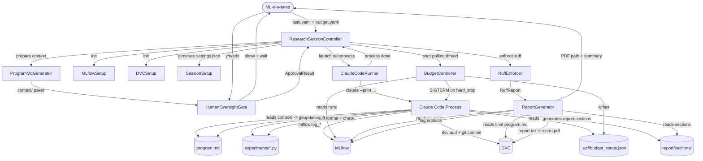

# Стадия 03: Design Document

**Проект:** Universal AutoResearch Framework (UAF)
**Дата:** 2026-03-19
**Версия:** 2.0 (архитектурный пересмотр)
**Статус:** STAGE COMPLETE
**Предшествующие стадии:** 01-problem (COMPLETE), 02-research (COMPLETE)
**Причина пересмотра:** Принципиальное изменение архитектуры — Claude Code как агент
вместо собственного LLM-клиента; ruff обязателен для всего генерируемого кода.

---

## Журнал изменений дизайна

| Версия | Дата | Изменение |
|--------|------|-----------|
| 1.0 | 2026-03-19 | Исходный дизайн: собственный LLM-клиент, Plan-and-Execute агент, ExperimentRunner с кодогенерацией |
| 2.0 | 2026-03-19 | Архитектурный пересмотр: Claude Code как агент; выброшены LLMClient, PlanningAgent, ExperimentRunner, FailureRecovery, AST-validator; добавлен ruff-enforcer |

**Что выброшено из v1.0 и почему:**

| Компонент v1.0 | Причина удаления |
|----------------|-----------------|
| LLMClient (Protocol + 3 реализации) | Claude Code сам управляет LLM-вызовами |
| PlanningAgent (LLM-планировщик) | UAF генерирует program.md статически; Claude Code его читает и автономно планирует следующий шаг |
| ExperimentRunner (codegen + execution) | Claude Code сам пишет и запускает код через свои встроенные инструменты |
| FailureRecovery (retry x3 LLM) | Claude Code сам обрабатывает ошибки: читает traceback, исправляет код, повторяет |
| AST-validator (запрещённые паттерны) | Безопасность делегирована settings.json Claude Code (allowedTools, permissions) |

---

## 0. Назначение документа

Этот документ фиксирует архитектурные решения UAF v2.0. После явного STAGE COMPLETE
команда переходит к стадии 04-metrics. Изменения после этой точки требуют явного RFC.

Документ отвечает на вопросы:
- Из каких компонентов состоит UAF v2.0, что каждый делает
- Как UAF взаимодействует с Claude Code (не управляет им — инициирует его)
- Как устроен lifecycle от запроса пользователя до PDF-отчёта
- Как генерируется program.md и что в нём
- Как работает HumanOversightGate
- Как работает BudgetController
- Как интегрированы MLflow и DVC
- Как ruff применяется к генерируемому коду
- Структура директорий

---

## 1. Архитектурная концепция

### 1.1 Ключевой сдвиг: UAF не управляет LLM, UAF управляет сессией

В v1.0 UAF был оркестратором, который дёргал LLM API для каждого шага:
планирования, кодогенерации, анализа, исправления ошибок. Это создавало
сложную систему с FailureRecovery, AST-валидацией, ExperimentRunner'ом.

В v2.0 UAF делает принципиально другое:
1. Генерирует `program.md` — исследовательский план в формате, который читает Claude Code
2. Ждёт одобрения человека
3. Запускает Claude Code в рабочей директории сессии с правильными настройками
4. Claude Code автономно читает `program.md`, пишет код, запускает, анализирует,
   обновляет план, продолжает — всё это без участия UAF в loop
5. UAF мониторит бюджет снаружи и останавливает сессию при исчерпании
6. По завершении UAF читает данные из MLflow и генерирует PDF-отчёт

Claude Code — это уже полноценный агент с встроенной способностью:
- Читать и писать файлы
- Выполнять bash-команды
- Обрабатывать ошибки (читает traceback, исправляет код, перезапускает)
- Рассуждать над результатами и планировать следующие шаги

UAF не дублирует эту функциональность. UAF предоставляет структуру, контроль
и наблюдаемость вокруг сессии Claude Code.

### 1.2 Принципы проектирования v2.0

**Принцип 1: Human Oversight as First-Class Citizen**
HumanOversightGate — архитектурный gate, не опция. Claude Code не запускается
без явного y от человека. Следствие antigoal 2 из стадии 01.

**Принцип 2: Observability by Default**
Claude Code пишет в MLflow напрямую (это часть program.md: инструкции по трекингу).
Каждое действие сессии наблюдаемо. Следствие antigoal 3.

**Принцип 3: Minimal Surface Area**
UAF — тонкая оболочка вокруг Claude Code. Не дублирует то, что Claude Code
умеет сам. Не строит собственный агентный фреймворк поверх готового агента.

**Принцип 4: Code Quality by Default**
ruff запускается на каждый Python-файл созданный Claude Code в процессе работы.
Это не безопасность — это качество и читаемость. Принцип из CLAUDE.md проекта.

### 1.3 Диаграмма архитектуры

```
Пользователь
     |
     | uaf run --task task.yaml --budget budget.yaml
     v
+----+--------------------------------------------------+
|                   UAF ORCHESTRATOR                     |
|                                                        |
|  +------------------+    +------------------------+   |
|  | ProgramMdGenerator|    | HumanOversightGate     |   |
|  | (статическая     |    | (approval checkpoint)  |   |
|  |  генерация плана)|    |                        |   |
|  +--------+---------+    +----------+-------------+   |
|           |                         |                  |
|           | program.md              | approved         |
|           v                         v                  |
|  +--------+---------+    +----------+-------------+   |
|  | SessionSetup     |    | BudgetController       |   |
|  | (dirs, MLflow,   |    | (monitor + stop)       |   |
|  |  DVC, settings)  |    |                        |   |
|  +------------------+    +------------------------+   |
|           |                         |                  |
|           | launch                  | stop signal      |
+----+------+-------------------------+------------------+
     |                                |
     v                                v (внешний процесс)
+----+----------------------------------+
|         CLAUDE CODE SESSION           |
|                                       |
|  читает: program.md                   |
|  пишет: experiments/*.py              |
|  запускает: python experiment.py      |
|  логирует: mlflow.log_metrics(...)    |
|  обновляет: program.md (статусы)      |
|  форматирует: ruff format + check     |
|  итерирует: до done/budget exhausted  |
+---------------------------------------+
     |
     | сессия завершена
     v
+----+--------------------------------------------------+
|                   UAF ORCHESTRATOR                     |
|                                                        |
|  +------------------+    +------------------------+   |
|  | ResultCollector  |    | ReportGenerator        |   |
|  | (MLflow query)   |--->| (LaTeX -> PDF)         |   |
|  +------------------+    +------------------------+   |
|                                    |                   |
|                                    | report.pdf        |
+------------------------------------+-------------------+
     |
     v
Пользователь получает:
  - report.pdf
  - MLflow UI URL
  - Краткое summary в терминале
```

---

## 2. Компоненты UAF v2.0

UAF содержит 6 компонентов (было 9 в v1.0). Три удалены полностью
(LLMClient, ExperimentRunner, FailureRecovery), один существенно упрощён
(PlanningAgent -> ProgramMdGenerator), один добавлен (RuffEnforcer).

### 2.1 Компоненты и слои

```
ORCHESTRATION LAYER
  ResearchSessionController  — state machine всей сессии
  BudgetController           — мониторинг бюджета, hard stop

GENERATION LAYER
  ProgramMdGenerator         — подготовка context/ пакета для Claude Code (без LLM)
  HumanOversightGate         — approval checkpoint

QUALITY LAYER
  RuffEnforcer               — применение ruff к генерируемому коду

STORAGE + INTEGRATION LAYER
  MLflowSetup                — инициализация и cross-referencing
  DVCSetup                   — инициализация и автоматические коммиты

REPORTING LAYER
  ReportGenerator            — LaTeX + PDF из MLflow данных
```

---

### 2.2 ResearchSessionController

**Ответственность:** главный оркестратор. Управляет lifecycle одной research session.
Реализует state machine. Не участвует в исследовательском loop — он завершается
внутри Claude Code.

**Состояния:**

```
IDLE -> GENERATING_PLAN -> AWAITING_APPROVAL -> SETTING_UP -> RUNNING
                                |                               |
                                v                               v
                           REJECTED                    MONITORING (фоновый)
                                                               |
                                               budget ok / done |
                                                               v
                                                         REPORTING -> DONE
                                                               |
                                                        budget stop
                                                               v
                                                      REPORTING_PARTIAL -> DONE
```

**Входные данные:**
- `TaskDescription`: описание ML-задачи от пользователя
- `BudgetConfig`: конфигурация бюджета
- `DataConfig`: путь к данным, описание признаков, целевая переменная
- `SessionConfig`: режим одобрения, настройки Claude Code

**Выходные данные:**
- `program.md`: план исследования (одобренный человеком)
- `report.pdf`: финальный PDF-отчёт
- Структура данных в MLflow и DVC

**Что НЕ делает:**
- Не вызывает LLM API напрямую (это делает ProgramMdGenerator через subprocess или API)
- Не выполняет код экспериментов (это делает Claude Code)
- Не анализирует результаты в loop (это делает Claude Code)
- Не восстанавливает ошибки в коде (это делает Claude Code)

**Взаимодействие с Claude Code:**
```
1. SessionController подготавливает рабочую директорию
2. Создаёт .claude/settings.json с нужными permissions
3. Запускает: claude --print --model claude-opus-4 \
              "Read program.md and execute the research plan"
4. Передаёт stdout/stderr в log-файл
5. Мониторит бюджет каждые N секунд (отдельный thread)
6. При hard stop: отправляет SIGTERM в процесс claude
7. При завершении: переходит в REPORTING
```

---

### 2.3 ProgramMdGenerator

**Ответственность:** подготовка контекста и шаблонной структуры `program.md` —
исследовательского плана в формате, который Claude Code может читать и исполнять автономно.

**Это принципиальное отличие от PlanningAgent в v1.0:**
- В v1.0 PlanningAgent был агентом внутри UAF: он использовал tools, читал MLflow,
  обновлял plan в реальном времени через собственный LLM-клиент
- В v2.0 ProgramMdGenerator готовит контекст (data_schema.json, task.yaml, шаблон)
  и записывает его в SESSION_DIR. Claude Code сам генерирует program.md в начале
  своей сессии на основе этого контекста, затем обновляет его по ходу работы.

**Техническая реализация:**
ProgramMdGenerator не делает LLM API вызовов. Он выполняет детерминированную
подготовку данных: читает task.yaml и data_schema.json, заполняет Jinja2 шаблон
известными полями (metadata, task description, execution instructions), записывает
результат в SESSION_DIR как `context/` пакет для Claude Code.

Claude Code при старте сессии:
1. Читает context/ (task.yaml, data_schema.json, шаблон program.md с заполненными полями)
2. Генерирует Research Phases на основе задачи и данных
3. Записывает финальный program.md в SESSION_DIR

Альтернатива (отклонена): прямой Anthropic API вызов из UAF для генерации program.md.
Причина отклонения: UAF не должен содержать API ключей и LLM вызовов. Вся работа LLM
происходит внутри одной Claude Code сессии — это принципиальное архитектурное решение.

**Что генерирует:**
```
program.md с секциями:
  - Metadata (session_id, task, budget, created_at)
  - Task Description (из task.yaml)
  - Research Phases (план с фазами и шагами)
  - Execution Instructions (как Claude Code должен работать: MLflow API,
    ruff требования, DVC commit protocol, budget awareness)
  - Current Status (заполняется Claude Code в процессе)
  - Iteration Log (заполняется Claude Code)
  - Final Conclusions (заполняется Claude Code)
```

**Ключевая особенность — секция Execution Instructions:**
Это часть program.md, которую UAF записывает как системные инструкции для
Claude Code. Claude Code читает их как часть задания. Содержит:
- Обязательные команды: `mlflow.start_run(...)`, `mlflow.log_metrics(...)`,
  `mlflow.log_params(...)` в каждом эксперименте
- Обязательный ruff: `ruff format {file} && ruff check {file} --fix`
  после создания каждого Python-файла
- DVC commit protocol: после каждого завершённого шага
- Правило failed experiments: не скрывать ошибки, логировать в MLflow
  с тегом `status=failed` и traceback как артефакт
- Budget awareness: периодически проверять файл `.uaf/budget_status.json`
  (записывается BudgetController). При `hard_stop=true` — завершить текущий
  эксперимент, написать выводы и остановиться.

**API:**
```python
def prepare_context(
    task: TaskDescription,
    data_schema: DataSchema,
    budget_config: BudgetConfig,
    session_id: str,
    improvement_context: Path | None = None,
) -> Path:
    """Подготавливает context/ пакет в SESSION_DIR для Claude Code.

    Возвращает путь к директории с контекстом.
    Claude Code генерирует program.md самостоятельно при запуске сессии.
    """
```

**Валидация структуры:**
После того как Claude Code сгенерировал program.md, UAF проверяет наличие
обязательных секций (Metadata, Task Description, Research Phases, Execution Instructions).
Если секция отсутствует — Claude Code уведомляется через session.log с запросом
дополнить program.md. Это обработка исключения, не регулярный путь.

---

### 2.4 HumanOversightGate

**Ответственность:** checkpoint, требующий явного одобрения человека до запуска
Claude Code. Реализует antigoal 2.

**Режимы:**
- `standard` (default): показывает program.md, ждёт y/n/edit
- `fully_autonomous`: пропускает gate (требует явного флага в SessionConfig)

**Протокол approval:**
```
1. Отображает program.md в терминале (rich-форматирование или fallback plain text)
2. Показывает summary:
   - Количество фаз, шагов, estimated runs
   - Estimated budget: N iterations / $X (если fixed mode)
   - Estimated time: ~N hours (грубая оценка)
3. Ждёт ввода: [y] одобрить / [n] отклонить / [e] редактировать

При [e]:
   4. Открывает $EDITOR (vim если не задан)
   5. Пользователь правит program.md
   6. Валидация структуры после правки
   7. Возврат к шагу 1
   Максимум 5 раундов редактирования

При [y]:
   8. Записывает approval метаданные в program.md (секция Metadata)
   9. Логирует: approval_status, approval_time, wait_time_seconds в MLflow
   10. DVC commit "program.md approved"
   11. Возвращает ApprovalResult{approved=True}

При [n]:
   12. ResearchSessionController -> REJECTED
   13. Пользователь может перезапустить с --resume {session_id} после ручной правки
```

**Что НЕ делает:**
- Не анализирует содержимое program.md (это дело пользователя)
- Не предлагает изменения (человек правит сам в $EDITOR)
- Не блокирует на неопределённое время (timeout 24 часа, затем auto-reject)

---

### 2.5 BudgetController

**Ответственность:** мониторинг бюджета сессии. В v2.0 работает снаружи Claude Code
как наблюдатель, а не как часть внутреннего loop.

**Архитектурное отличие от v1.0:**
В v1.0 BudgetController вызывался ExperimentRunner'ом после каждого эксперимента.
В v2.0 BudgetController работает в отдельном thread с polling интервалом.
Claude Code читает бюджетный статус из файла `.uaf/budget_status.json`.

**Что мониторит:**

Fixed mode:
```yaml
budget:
  mode: fixed
  max_iterations: 20         # считаем по числу MLflow runs
  max_cost_usd: 5.0          # считаем по токенам (через MLflow tags)
  max_time_hours: 8          # wall clock
```

Dynamic mode:
```yaml
budget:
  mode: dynamic
  convergence:
    patience: 3
    min_delta: 0.001
    min_iterations: 3
  safety_cap:
    max_iterations: 50
    max_cost_usd: 20.0
    max_time_hours: 24
```

**Как считает итерации:**
BudgetController периодически (каждые 30 секунд) опрашивает MLflow через
`mlflow.tracking.MlflowClient().search_runs(experiment_ids=[...])`.
Количество runs с тегом `type=experiment` = количество итераций.

**Hard Stop протокол:**
```
1. BudgetController обнаруживает превышение лимита
2. Записывает в .uaf/budget_status.json: {"hard_stop": true, "reason": "..."}
3. Claude Code читает этот файл при следующей проверке (инструкция в program.md)
   и корректно завершает текущий эксперимент
4. BudgetController ждёт завершения текущего эксперимента (grace period: 5 минут)
5. Если за 5 минут Claude Code не остановился: SIGTERM в процесс claude
6. ResultCollector запускается с флагом partial=True
```

**Конвергенция в dynamic mode:**
```python
def check_convergence(
    metrics_history: list[float],
    patience: int,
    min_delta: float,
    min_iterations: int,
) -> bool:
    if len(metrics_history) < min_iterations:
        return False
    recent = metrics_history[-patience:]
    deltas = [
        abs(recent[i] - recent[i-1]) / (abs(recent[i-1]) + 1e-10)
        for i in range(1, len(recent))
    ]
    return all(d < min_delta for d in deltas)
```

Дополнительный сигнал: BudgetController читает из MLflow tag
`convergence_signal` (записывается Claude Code по собственной оценке).
При convergence_signal >= 0.9 AND len >= min_iterations — тоже hard stop.

**Soft Warning:**
При 80% использованного бюджета: уведомление в терминале + MLflow tag
`budget_warning=True`. Claude Code видит это через `.uaf/budget_status.json`.

---

### 2.6 RuffEnforcer

**Ответственность:** применение ruff (форматирование + линтинг) к каждому Python-файлу,
созданному Claude Code в процессе работы.

**Зачем это нужно:**
Claude Code пишет корректный Python, но стиль может быть непоследовательным.
ruff — инструмент для обеспечения единого стиля во всех генерируемых экспериментах.
Это не про безопасность, это про читаемость и поддерживаемость кода.

**Два уровня enforcement:**

Уровень 1 — в program.md как инструкция для Claude Code:
```
После создания каждого Python-файла выполни:
  ruff format {filepath}
  ruff check {filepath} --fix
Если ruff check завершается с ошибками которые не исправляются --fix:
  исправь вручную, не пропускай.
```
Это основной механизм: Claude Code сам применяет ruff, потому что
это написано в его инструкциях.

Уровень 2 — post-processing после завершения сессии (RuffEnforcer компонент):
```python
def enforce_on_session(session_path: Path) -> RuffReport:
    """Прогнать ruff по всем .py файлам сессии после завершения."""
    py_files = list(session_path.glob("**/*.py"))
    results = []
    for f in py_files:
        format_result = subprocess.run(["ruff", "format", str(f)], capture_output=True)
        check_result = subprocess.run(
            ["ruff", "check", str(f), "--fix"], capture_output=True
        )
        results.append(RuffResult(file=f, formatted=format_result.returncode == 0,
                                  violations=parse_ruff_output(check_result.stdout)))
    return RuffReport(files=results)
```

Post-processing не блокирует сессию — это фиксация качества в отчёте.
RuffReport включается в ReportGenerator как секция "Code Quality".

**Конфигурация ruff:**
```toml
# pyproject.toml в директории сессии (копируется из шаблона UAF)
[tool.ruff]
line-length = 99
target-version = "py310"

[tool.ruff.lint]
select = ["E", "F", "W", "I", "N", "UP", "B", "A", "SIM", "TCH", "RUF"]
```

---

### 2.7 MLflowSetup

**Ответственность:** инициализация MLflow для сессии и поддержание cross-referencing
между MLflow runs и DVC коммитами.

**Что делает при инициализации сессии:**
```python
1. Запускает mlflow server (если auto_start_server=True):
   mlflow server --backend-store-uri sqlite:///.uaf/mlflow.db \
                 --default-artifact-root .uaf/mlruns/ \
                 --host 127.0.0.1 --port 5000

2. Создаёт experiment: uaf/{session_id}

3. Создаёт planning run:
   with mlflow.start_run(run_name="planning/initial"):
       mlflow.log_params({"session_id": session_id, "task_title": task.title, ...})
       mlflow.log_artifact(program_md_path)
       mlflow.set_tag("type", "planning")
       mlflow.set_tag("approval_status", "pending")

4. Записывает experiment_id и tracking_uri в .uaf/mlflow_context.json
   (Claude Code читает этот файл чтобы знать куда логировать)
```

**Cross-referencing MLflow <-> DVC:**
- Каждый DVC commit message содержит `mlflow_run_id: {run_id}`
- Каждый MLflow run содержит tag `dvc_commit: {git_sha}`
- Это позволяет восстановить любое состояние: по run_id найти git SHA,
  `git checkout {sha} && dvc checkout` — получить точное состояние кода и данных

**Что записывает Claude Code в MLflow:**
(Claude Code получает инструкции через program.md/Execution Instructions)
```python
# В каждом experiment.py, написанном Claude Code:
import mlflow

with mlflow.start_run(
    experiment_id="{experiment_id_from_mlflow_context}",
    run_name="{phase_id}/{step_id}"
) as run:
    mlflow.log_params({
        "step_id": "{step_id}",
        "session_id": "{session_id}",
        "seed": 42,
        **hyperparams
    })
    mlflow.set_tag("type", "experiment")
    mlflow.set_tag("status", "running")

    # ... код эксперимента ...

    mlflow.log_metrics(metrics)
    mlflow.log_artifact(str(Path(__file__)))  # сам код
    mlflow.set_tag("status", "success")
    mlflow.set_tag("convergence_signal", str(convergence_signal))
```

При failure:
```python
mlflow.set_tag("status", "failed")
mlflow.log_text(traceback_str, "traceback.txt")
mlflow.set_tag("failure_reason", brief_reason)
```

---

### 2.8 DVCSetup

**Ответственность:** инициализация DVC и автоматические коммиты при значимых событиях.

**Инициализация:**
```bash
# Если .dvc/ не существует в рабочей директории:
dvc init
dvc remote add local_cache .uaf/dvc-cache

# Добавить .uaf/sessions/ в .dvcignore исключения (не версионировать venv)
```

**Автоматические DVC-коммиты:**
DVCSetup слушает события от ResearchSessionController:

| Событие | DVC action |
|---------|------------|
| program.md сгенерирован | `dvc add program.md`, `git commit -m "session {id}: initial program.md"` |
| program.md одобрен | `git commit -m "session {id}: program.md approved"` (update .dvc file) |
| Шаг плана завершён | `dvc add experiments/{step_id}/`, `git commit -m "session {id}: step {step_id} complete [mlflow_run_id: {id}]"` |
| Финальный отчёт | `dvc add reports/{session_id}/`, `git commit -m "session {id}: final report"` |

**Что НЕ версионируется через DVC:**
- venv директория (в .dvcignore)
- MLflow база данных (mlflow.db в .gitignore)
- .uaf/budget_status.json (эфемерный файл)
- .uaf/mlflow_context.json (эфемерный файл)

---

### 2.9 ReportGenerator

**Ответственность:** генерация финального отчёта в LaTeX с компиляцией в PDF.
Запускается после завершения сессии Claude Code.

**Входные данные:**
Все данные читаются из MLflow. ReportGenerator не читает эксперименты напрямую.

```python
client = mlflow.tracking.MlflowClient()
all_runs = client.search_runs(
    experiment_ids=[experiment_id],
    filter_string=f"tags.session_id = '{session_id}'"
)
# Включает ВСЕ runs: planning, experiments (success + failed), analysis
```

**Структура LaTeX-отчёта:**

```latex
\section{Executive Summary}
% LLM-генерируемый (один API вызов): главный вывод + рекомендация.
% Вход: all_runs summary. Выход: 1 страница.

\section{Task Description}
% Автоматически из task.yaml

\section{Research Program}
% Автоматически из финального состояния program.md

\section{Experiment Results}
  \subsection{Overview}
  % Сводная таблица: step, метрика, статус, run_id
  % Включает failed runs (серым, не скрываем - antigoal 3)

  \subsection{Baseline}
  % Детали baseline experiments

  \subsection{Improvement Iterations}
  % Детали всех iterations

  \subsection{Failed Experiments}
  % Отдельная секция. Причина failure, traceback summary.
  % Ключевое отличие от AI Scientist (который скрывает неудачи).

\section{Analysis and Findings}
% LLM-генерируемый: выводы из полных данных (не фильтрованных)

\section{Recommendations}
% LLM-генерируемый: next_steps с приоритетами

\section{Code Quality Report}
% Автоматически из RuffReport: сколько файлов, violations по категориям

\section{Reproducibility}
% Автоматически: session_id, все run_ids, версии зависимостей,
% DVC commit hashes, claude model version, seed values

\section{Appendix: Experiment Code}
% Финальный код каждого эксперимента (листинги)
% После применения ruff (читаем из DVC)
```

**Генерация текстовых секций отчёта:**
ReportGenerator не делает прямых LLM API вызовов. Текстовые секции отчёта
генерирует Claude Code в рамках своей сессии — как финальный этап после
завершения всех экспериментов.

Последовательность в конце сессии Claude Code:
1. Эксперименты завершены, program.md обновлён с Final Conclusions
2. Claude Code читает session_analysis.json и все данные из MLflow
3. Claude Code генерирует текстовые секции отчёта:
   - Executive Summary
   - Analysis and Findings
   - Recommendations
4. Claude Code сохраняет сгенерированные тексты в SESSION_DIR/report/sections/
5. UAF ReportGenerator читает эти тексты, собирает .tex через Jinja2 и компилирует PDF

Вся работа LLM (план + эксперименты + отчёт) происходит внутри одной Claude Code сессии.

**Технический pipeline генерации:**
```
(Внутри Claude Code, финальный этап сессии):
1. Claude Code читает session_analysis.json и all_runs из MLflow
2. Claude Code генерирует текстовые секции:
   - SESSION_DIR/report/sections/executive_summary.md
   - SESSION_DIR/report/sections/analysis_and_findings.md
   - SESSION_DIR/report/sections/recommendations.md
3. Claude Code компилирует PDF:
   python uaf_report_compile.py --session-id {id}
   (вызывает ReportGenerator.compile_from_sections())

(UAF ReportGenerator.compile_from_sections()):
1. Читает готовые текстовые секции из SESSION_DIR/report/sections/
2. Генерация figures (matplotlib -> PDF):
   - metric_over_iterations.pdf
   - hyperparameter_importance.pdf (если HPO был)
   - runs_comparison_heatmap.pdf
3. Сборка .tex через Jinja2 шаблон
4. Компиляция:
   tectonic report.tex -> report.pdf       (предпочтительно)
   pdflatex report.tex -> report.pdf       (fallback)
   warn + save .tex                        (если LaTeX недоступен)
5. DVC add + MLflow log artifacts
```

**LaTeX зависимости:** tectonic (предпочтительный, скачивает пакеты сам),
pdflatex (альтернатива). Пакеты: booktabs, listings, xcolor, hyperref,
geometry, microtype, fancyhdr, graphicx, longtable.

---

## 3. Claude Code settings.json

### 3.1 Назначение

settings.json — конфигурация Claude Code для сессии UAF. Определяет:
- Какие инструменты разрешены (allowedTools)
- Какие команды разрешены (bash permissions)
- Режим автоподтверждения (для fully_autonomous mode)

Это то, что в v1.0 делал AST-валидатор: ограничение опасных операций.
Разница: Claude Code settings — это enforcement на уровне агентной платформы,
а не наш hand-rolled валидатор.

### 3.2 Структура settings.json

```json
{
  "model": "claude-opus-4",
  "permissions": {
    "allow": [
      "Bash(python:*)",
      "Bash(pip install:*)",
      "Bash(ruff:*)",
      "Bash(mlflow:*)",
      "Bash(git add:*)",
      "Bash(git commit:*)",
      "Bash(dvc add:*)",
      "Bash(dvc commit:*)",
      "Read(*)",
      "Write(.uaf/sessions/{session_id}/**)",
      "Write(.uaf/mlruns/**)"
    ],
    "deny": [
      "Bash(rm -rf:*)",
      "Bash(curl:*)",
      "Bash(wget:*)",
      "Bash(ssh:*)",
      "Bash(sudo:*)",
      "Write(../..)"
    ]
  },
  "env": {
    "MLFLOW_TRACKING_URI": "http://127.0.0.1:5000",
    "MLFLOW_EXPERIMENT_NAME": "uaf/{session_id}",
    "UAF_SESSION_ID": "{session_id}",
    "UAF_BUDGET_STATUS_FILE": ".uaf/budget_status.json"
  }
}
```

### 3.3 Генерация settings.json

SessionSetup генерирует settings.json в `.claude/settings.json` рабочей директории
перед запуском Claude Code. Параметры заполняются из SessionConfig.

В `fully_autonomous` режиме добавляется:
```json
{
  "dangerouslyAllowAutoApprove": true
}
```

---

## 4. program.md: структура и lifecycle

### 4.1 Структура program.md v2.0

Ключевое отличие от v1.0: добавлена секция **Execution Instructions** —
явные инструкции для Claude Code о том, как работать.

```markdown
# Research Program: {task_name}

## Metadata
- session_id: {uuid}
- created: {iso_timestamp}
- approved_by: human | auto
- approval_time: {iso_timestamp}
- budget_mode: fixed | dynamic
- budget_summary: {краткое описание лимитов}
- claude_model: claude-opus-4
- mlflow_experiment: uaf/{session_id}
- mlflow_tracking_uri: http://127.0.0.1:5000

## Task Description
{Текстовое описание задачи, датасета, целевой метрики.
Скопировано из task.yaml с форматированием.}

## Research Phases

### Phase 1: Baseline
**Goal:** {цель фазы}
**Success Criterion:** {метрика + threshold}

#### Step 1.1: {название}
- **Hypothesis:** {что проверяем}
- **Method:** {как проверяем}
- **Metric:** {целевая метрика + желаемое значение}
- **Critical:** true/false
- **Status:** pending
- **MLflow Run ID:** null
- **Result:** (заполняется Claude Code)
- **Conclusion:** (заполняется Claude Code)

#### Step 1.2: ...

### Phase 2: Improvement Iterations
...

## Current Status
- **Active Phase:** Phase 1
- **Completed Steps:** 0/{total}
- **Best Result:** null
- **Budget Used:** 0%

## Iteration Log
(заполняется Claude Code после каждой итерации)

## Final Conclusions
(заполняется Claude Code по завершении)

---

## Execution Instructions

ВАЖНО: Эти инструкции обязательны к исполнению для каждого шага.

### MLflow Logging
Каждый Python-эксперимент ОБЯЗАН использовать MLflow:

```python
import mlflow
import os

MLFLOW_TRACKING_URI = os.environ["MLFLOW_TRACKING_URI"]
EXPERIMENT_NAME = os.environ["MLFLOW_EXPERIMENT_NAME"]
SESSION_ID = os.environ["UAF_SESSION_ID"]

mlflow.set_tracking_uri(MLFLOW_TRACKING_URI)
mlflow.set_experiment(EXPERIMENT_NAME)

with mlflow.start_run(run_name="{phase}/{step}") as run:
    mlflow.set_tag("session_id", SESSION_ID)
    mlflow.set_tag("step_id", "{step_id}")
    mlflow.set_tag("type", "experiment")
    mlflow.set_tag("status", "running")
    mlflow.log_params({...})

    # ... эксперимент ...

    mlflow.log_metrics({...})
    mlflow.log_artifact(__file__)
    mlflow.set_tag("status", "success")
    mlflow.set_tag("convergence_signal", "{0.0-1.0}")
```

При любом exception:
```python
import traceback
mlflow.set_tag("status", "failed")
mlflow.log_text(traceback.format_exc(), "traceback.txt")
mlflow.set_tag("failure_reason", "{краткое описание}")
```

### Code Quality
После создания каждого Python-файла:
```bash
ruff format {filepath}
ruff check {filepath} --fix
```
Если после --fix остаются ошибки — исправь вручную.

### Budget Check
Перед каждым новым экспериментом прочитай {UAF_BUDGET_STATUS_FILE}:
```python
import json
status = json.loads(Path(budget_file).read_text())
if status.get("hard_stop"):
    # Завершить текущую работу, написать выводы, остановиться
    break
```

### DVC Protocol
После завершения каждого шага:
```bash
dvc add .uaf/sessions/{session_id}/experiments/{step_id}/
git add .uaf/sessions/{session_id}/experiments/{step_id}/*.dvc
git commit -m "session {session_id}: step {step_id} complete [mlflow_run_id: {run_id}]"
```

### Update program.md
После каждого шага обновляй секции:
- Step статус: pending -> done/failed
- Step MLflow Run ID: заполни run_id
- Step Result: заполни метрику
- Step Conclusion: напиши вывод
- Current Status: обнови Best Result и Budget Used
- Iteration Log: добавь запись
```
```

### 4.2 Lifecycle program.md

```
Событие                      Кто делает           Что происходит
-------------------------------------------------------------------
1. Подготовка контекста       ProgramMdGenerator   Записывает context/ пакет в SESSION_DIR
                                                   DVC add + git commit "context prepared"
   Генерация program.md       Claude Code          Читает context/, генерирует program.md
                                                   DVC add + git commit "program.md generated"

2. Показ пользователю         HumanOversightGate   Отображает в терминале

3. Редактирование             Человек ($EDITOR)    Правит program.md

4. Одобрение                  HumanOversightGate   Обновляет Metadata
                                                   DVC commit "approved"

5. Выполнение шагов           Claude Code          Обновляет Status секции
                                                   Заполняет Run ID, Result
                                                   Пишет в Iteration Log

6. Re-planning                Claude Code          Может добавлять шаги
   (не требует re-approval                         в существующие фазы
    если не меняет scope)

7. Финализация                Claude Code          Заполняет Final Conclusions
                                                   DVC commit "session complete"
```

**Re-approval при существенных изменениях:**
Если Claude Code собирается добавить принципиально новую фазу или изменить
целевую метрику — это должно быть записано в program.md с пометкой
`REQUIRES_HUMAN_REVIEW`. BudgetController замечает эту пометку при следующем
polling и уведомляет пользователя (приостанавливает бюджетный таймер).

---

## 5. Технические решения (TR-1 — TR-5)

В v2.0 TR-1 (LLM Provider) и TR-6 (Failure Recovery) упразднены.
Остаются TR-2 (Isolation), TR-3 (Agent Architecture), TR-4 (program.md),
TR-5 (Convergence). Добавлен TR-7 (ruff enforcement) и TR-8 (Claude Code integration).

### TR-2: Claude Code Execution Environment

**Решение: Claude Code работает в изолированной директории сессии с настроенным
settings.json вместо venv-изоляции через UAF.**

**Обоснование пересмотра v1.0:**
В v1.0 ExperimentRunner создавал venv и запускал код в нём. Это имело смысл,
потому что UAF сам генерировал и запускал эксперименты.

В v2.0 Claude Code сам устанавливает зависимости (через pip) и запускает код.
Claude Code работает в системном Python — это нормально, потому что:
- Claude Code ограничен в действиях через settings.json
- pip install в системный Python — приемлемо для локальной машины ML-инженера
  (который и так ставит пакеты в системный Python)
- Создание venv для каждой сессии — избыточно: Claude Code сам решит как
  управлять зависимостями

Если пользователю нужна вenv-изоляция — он описывает это в task.yaml и
ProgramMdGenerator включает инструкцию "использовать venv" в program.md.

**Что реально обеспечивает изоляцию в v2.0:**
- settings.json: `Write(.uaf/sessions/{id}/**)` — Claude Code пишет только
  в директорию сессии
- settings.json: deny list для опасных команд (rm -rf, curl и т.д.)
- Рабочая директория Claude Code = директория сессии

**Таймауты:**
ResearchSessionController устанавливает системный таймаут через
`subprocess.run(["claude", ...], timeout=session_timeout_seconds)`.
Если Claude Code завис — SIGTERM.

```yaml
execution:
  session_timeout_hours: 24    # максимум на всю сессию
  grace_period_minutes: 5      # ждать корректного завершения при SIGTERM
```

### TR-3: Agent Architecture

**Решение: Claude Code как единый агент (не Plan-and-Execute через UAF).**

**Было в v1.0:** Plan-and-Execute с явным разделением PlanningAgent и ExperimentRunner.
UAF оркестрировал каждый шаг в loop.

**Стало в v2.0:** Claude Code — единый агент, который сам реализует Plan-and-Execute
внутри своей сессии. UAF создаёт условия (program.md + settings.json) и наблюдает снаружи.

**Почему это лучше:**
- Claude Code — более мощный агент чем то, что мы могли бы построить сами:
  встроенная retry-логика, tool use, long context, рассуждение над ошибками
- Меньше кода в UAF: убираем PlanningAgent (500+ строк) + ExperimentRunner (300+ строк) +
  FailureRecovery (200+ строк)
- Архитектура Karpathy/autoresearch: именно так он это делал

**Что сохраняется от Plan-and-Execute:**
- Program.md как явный plan-артефакт (обязательное условие для human oversight)
- HumanOversightGate между генерацией плана и запуском (архитектурный gate)
- Living document: Claude Code обновляет program.md по ходу работы

**Ограничение:** UAF теряет fine-grained контроль над каждым шагом исследования.
Мы не можем остановить Claude Code между шагами (только при завершении всей сессии
или при hard stop через budget_status.json). Это принятый компромисс: мы доверяем
Claude Code как агенту в рамках одобренного plan'а.

### TR-4: program.md как контракт с Claude Code

**Решение: program.md — главный интерфейс между UAF и Claude Code.**

program.md содержит не только план исследования, но и полные инструкции по выполнению:
как логировать в MLflow, как применять ruff, как проверять бюджет, как обновлять
статусы. Claude Code читает эти инструкции как часть своего задания.

**Это принципиальный дизайнерский выбор:**
Альтернатива — системный промпт при вызове Claude Code. Но program.md лучше:
- Человек видит и одобряет все инструкции (transparency)
- Инструкции версионируются вместе с планом в DVC
- Инструкции можно редактировать при [e] в HumanOversightGate

**Риск: Claude Code может игнорировать инструкции.**
Митигация: BudgetController проверяет соответствие (есть ли MLflow runs,
есть ли DVC commits после шагов). При отсутствии — уведомляет пользователя.

### TR-5: Convergence Criterion (динамический бюджет)

**Без изменений относительно v1.0.**

Комбинированный критерий:
```
converged = (no_improvement_count >= patience) AND (last_delta < min_delta)
            AND (len(history) >= min_iterations)
```

Плюс LLM-сигнал: Claude Code записывает `convergence_signal` в MLflow tags.
BudgetController читает его при polling.

Safety cap в dynamic mode: max_iterations, max_cost_usd, max_time_hours.

### TR-7: ruff Enforcement

**Решение: двухуровневый enforcement — инструкция в program.md + post-processing.**

**Уровень 1 (основной):** Claude Code получает инструкцию в program.md применять
ruff после каждого созданного Python файла. Это работает потому что Claude Code
следует инструкциям в своём контексте.

**Уровень 2 (гарантийный):** RuffEnforcer запускается после завершения сессии
и применяет ruff ко всем .py файлам. Результат включается в отчёт.

**Конфигурация:** `pyproject.toml` копируется в директорию сессии из шаблона UAF.
Настройки соответствуют глобальным правилам кода проекта (99 символов, Python 3.10+,
полный набор правил ruff).

### TR-8: UAF не делает прямых LLM вызовов

**Решение: UAF — чистая Python утилита без LLM вызовов. Вся работа LLM выполняется
внутри одной Claude Code сессии.**

**Принцип:** UAF не содержит API ключей Anthropic. Нет прямых вызовов Anthropic SDK
из UAF компонентов. Это принципиальное архитектурное ограничение, а не компромисс.

**Разделение ответственности:**
- UAF: оркестрация, подготовка контекста, мониторинг бюджета, сборка отчёта из готовых данных
- Claude Code: генерация program.md, проведение экспериментов, генерация текстовых секций отчёта

**Lifecycle LLM-работы внутри Claude Code сессии:**
1. Старт сессии: Claude Code читает context/ пакет, генерирует program.md
2. Исследовательский loop: Claude Code пишет и запускает эксперименты, обновляет program.md
3. Финал сессии: Claude Code генерирует текстовые секции отчёта, вызывает компиляцию PDF

**Конфигурация Claude Code** (в settings.json, генерируется UAF SessionSetup):
```json
{
  "model": "claude-opus-4",
  "env": {
    "MLFLOW_TRACKING_URI": "http://127.0.0.1:5000",
    "MLFLOW_EXPERIMENT_NAME": "uaf/{session_id}",
    "UAF_SESSION_ID": "{session_id}",
    "UAF_BUDGET_STATUS_FILE": ".uaf/budget_status.json"
  }
}
```

**Что НЕ делается:**
- Нет Anthropic SDK в зависимостях UAF (удалён из buy-списка)
- Нет ANTHROPIC_API_KEY в конфигурации UAF
- Нет provider-agnostic абстракции для UAF-компонентов

---

## 6. Интерфейсы

### 6.1 Data Transfer Objects

```python
from dataclasses import dataclass, field
from pathlib import Path
from typing import Literal


@dataclass
class TaskDescription:
    title: str
    problem_statement: str
    dataset_path: Path
    target_column: str
    metric: str
    metric_direction: Literal["maximize", "minimize"]
    additional_context: str | None = None


@dataclass
class BudgetConfig:
    mode: Literal["fixed", "dynamic"]
    # fixed mode
    max_iterations: int | None = None
    max_cost_usd: float | None = None
    max_time_hours: float | None = None
    # dynamic mode
    patience: int = 3
    min_delta: float = 0.001
    min_iterations: int = 3
    # safety cap (dynamic only)
    safety_cap_iterations: int = 50
    safety_cap_cost_usd: float = 20.0
    safety_cap_time_hours: float = 24.0
    # общие
    soft_warning_fraction: float = 0.8


@dataclass
class SessionConfig:
    session_id: str  # UUID, генерируется автоматически
    approval_mode: Literal["standard", "fully_autonomous"] = "standard"
    claude_model: str = "claude-opus-4"
    session_timeout_hours: float = 24.0
    grace_period_minutes: float = 5.0
    budget_poll_interval_seconds: int = 30
    mlflow_tracking_uri: str = "http://127.0.0.1:5000"
    mlflow_auto_start_server: bool = True


@dataclass
class ApprovalResult:
    approved: bool
    modified: bool
    approval_mode: str
    wait_time_seconds: float
    edit_rounds: int = 0
    notes: str | None = None


@dataclass
class BudgetStatus:
    mode: str
    consumed_iterations: int
    consumed_cost_usd: float
    consumed_time_hours: float
    remaining_fraction: float  # только для fixed mode
    convergence_signal: float  # только для dynamic mode
    warning_triggered: bool
    hard_stop: bool
    hard_stop_reason: str | None = None


@dataclass
class RuffResult:
    file: Path
    formatted: bool
    violations_before_fix: int
    violations_after_fix: int
    unfixable_violations: list[str] = field(default_factory=list)


@dataclass
class RuffReport:
    files: list[RuffResult]
    total_files: int
    clean_files: int
    files_with_unfixable: int
```

### 6.2 Интерфейс CLI

```
uaf run --task task.yaml [--budget budget.yaml] [--model claude-opus-4]
        [--fully-autonomous] [--resume {session_id}]

uaf status [{session_id}]    <- текущий статус сессии

uaf stop [{session_id}]      <- graceful stop текущей сессии

uaf report [{session_id}]    <- регенерировать отчёт из MLflow данных

uaf cleanup [--sessions-older-than 7d]
```

### 6.3 Файловые интерфейсы (Claude Code читает/пишет)

```
Читает:
  .uaf/sessions/{id}/context/                <- task.yaml, data_schema.json, шаблон
  .uaf/sessions/{id}/program.md              <- план + инструкции (после генерации)
  .uaf/mlflow_context.json                   <- experiment_id, tracking_uri
  .uaf/budget_status.json                    <- текущий статус бюджета
  data/                                      <- датасет (readonly)

Пишет:
  .uaf/sessions/{id}/program.md              <- генерирует в начале, обновляет в процессе
  .uaf/sessions/{id}/experiments/{step_id}/  <- код, логи экспериментов
  .uaf/sessions/{id}/report/sections/        <- текстовые секции отчёта (в конце)
  .uaf/mlruns/                               <- MLflow artifacts
```

---

## 7. MLflow + DVC интеграция

### 7.1 MLflow структура runs

```
MLflow Experiments:
  uaf/{session_id}/

Runs:
  planning/initial
    params: session_id, task_title, budget_mode, llm_model
    artifacts: program.md (draft)
    tags: type=planning, approval_status=pending|approved

  {phase_id}/{step_id}
    params: step_id, session_id, seed, **hyperparams
    metrics: {target_metric, ...}
    artifacts: {step_id}.py, stdout.log, stderr.log, figures/
    tags:
      type=experiment
      session_id={uuid}
      step_id={phase}.{step}
      status=running|success|failed
      critical=true|false
      convergence_signal={0.0-1.0}
      dvc_commit={git_sha}

  report/final
    artifacts: report.tex, report.pdf, figures/
    tags: type=report, status=complete
```

### 7.2 DVC структура

```
Версионируется:
  .uaf/sessions/{id}/program.md         <- план (меняется в ходе сессии)
  .uaf/sessions/{id}/experiments/       <- код экспериментов
  .uaf/sessions/{id}/reports/           <- финальный отчёт
  data/                                 <- исходные данные (read-only ref)

НЕ версионируется:
  .uaf/mlflow.db                        <- SQLite (в .gitignore)
  .uaf/mlruns/                          <- MLflow artifacts (в .gitignore)
  .uaf/budget_status.json               <- эфемерный файл
  .uaf/mlflow_context.json              <- эфемерный файл
```

Cross-referencing:
- DVC commit message содержит `mlflow_run_id: {id}`
- MLflow run tag `dvc_commit` содержит `{git_sha}`

---

## 8. Структура директорий проекта

### 8.1 Репозиторий UAF

```
uaf/
  pyproject.toml                  <- зависимости, ruff конфиг, pytest
  uaf.yaml                        <- глобальная конфигурация по умолчанию

  uaf/                            <- Python пакет
    __init__.py
    cli.py                        <- CLI: uaf run / status / stop / report / cleanup

    core/
      __init__.py
      controller.py               <- ResearchSessionController (state machine)
      state.py                    <- SessionState enum + transitions
      session.py                  <- SessionConfig, DataConfig

    generation/
      __init__.py
      program_md_generator.py     <- ProgramMdGenerator (1 LLM call)
      program_md_schema.py        <- ProgramDoc: dataclass + validator
      templates/
        program_md.md.jinja2      <- шаблон program.md
        execution_instructions.md.jinja2  <- секция инструкций для Claude Code
        settings_json.jinja2      <- шаблон Claude Code settings.json

    oversight/
      __init__.py
      gate.py                     <- HumanOversightGate

    budget/
      __init__.py
      controller.py               <- BudgetController (polling thread)
      convergence.py              <- check_convergence()
      status_file.py              <- BudgetStatus -> .uaf/budget_status.json

    quality/
      __init__.py
      ruff_enforcer.py            <- RuffEnforcer (post-processing)

    integrations/
      __init__.py
      mlflow_setup.py             <- MLflowSetup (init + experiment creation)
      dvc_setup.py                <- DVCSetup (init + auto commits)
      claude_code_runner.py       <- запуск claude subprocess

    reporting/
      __init__.py
      generator.py                <- ReportGenerator
      latex_builder.py            <- Jinja2 -> .tex
      figure_generator.py         <- matplotlib figures -> PDF
      llm_sections.py             <- LLM-генерируемые секции отчёта
      templates/
        report_main.tex.jinja2
        sections/
          executive_summary.tex.jinja2
          experiment_results.tex.jinja2
          analysis.tex.jinja2
          code_quality.tex.jinja2
          reproducibility.tex.jinja2

    config/
      __init__.py
      schema.py                   <- Pydantic-схемы всех конфигов
      pricing.yaml                <- стоимость токенов (ручное обновление)
      defaults.yaml               <- дефолты
      ruff_template.toml          <- шаблон pyproject.toml для сессий

  tests/
    unit/
      test_budget_controller.py
      test_convergence.py
      test_program_md_generator.py
      test_program_md_schema.py
      test_ruff_enforcer.py
    integration/
      test_mlflow_integration.py
      test_dvc_integration.py
      test_claude_code_runner.py  <- mock Claude Code subprocess
    e2e/
      test_full_session.py        <- end-to-end с mock Claude Code

  docs/
    stage-01-problem.md
    stage-02-research.md
    stage-03-design-doc.md
    progress.md

  examples/
    classification_task/
      task.yaml
      budget_fixed.yaml
      budget_dynamic.yaml
      dataset/
    regression_task/
      task.yaml
```

### 8.2 Рабочая директория пользователя

```
my_ml_project/
  data/
    train.csv                     <- данные (readonly для Claude Code)
    test.csv

  task.yaml                       <- входной файл UAF
  budget.yaml                     <- конфигурация бюджета

  .claude/
    settings.json                 <- генерируется UAF SessionSetup (per-session)

  .uaf/                           <- создаётся UAF
    mlflow.db                     <- SQLite MLflow (.gitignore)
    mlruns/                       <- MLflow artifacts (.gitignore)
    dvc-cache/                    <- DVC кэш
    mlflow_context.json           <- эфемерный: experiment_id, tracking_uri
    budget_status.json            <- эфемерный: текущий статус бюджета

    sessions/
      {session_id}/
        program.md                <- DVC-tracked (читает Claude Code)
        program.md.dvc
        task.yaml                 <- копия (readonly)
        budget.yaml               <- копия (readonly)

        experiments/
          phase1_step1/
            experiment.py         <- пишет Claude Code
            experiment.py.dvc
            stdout.log
            stderr.log
          phase1_step2/
            ...

        reports/
          report.tex              <- DVC-tracked
          report.tex.dvc
          report.pdf              <- DVC-tracked
          report.pdf.dvc
          figures/
            metric_over_iterations.pdf
            runs_comparison_heatmap.pdf
```

### 8.3 task.yaml формат

```yaml
task:
  title: "Классификация оттока клиентов"
  problem_statement: |
    Предсказать отток клиентов банка по транзакционным данным.
    Данные: 50k клиентов, 30 признаков, целевая переменная churn (0/1).
    Известные проблемы: дисбаланс классов 5:95, пропуски в 3 признаках.

  dataset:
    train_path: data/train.csv
    test_path: data/test.csv
    target_column: churn
    id_column: client_id

  metric:
    name: roc_auc
    direction: maximize

  constraints:
    max_training_time_minutes: 30
    available_memory_gb: 16

# Опциональные поля
research_preferences:
  baseline_model: catboost
  techniques_to_explore:
    - feature_selection
    - class_imbalance_handling
    - hyperparameter_optimization
  techniques_to_avoid:
    - deep_learning
  use_venv: false   # если true — ProgramMdGenerator добавляет инструкцию по venv
```

---

## 9. Lifecycle: от CLI-команды до PDF

```
Пользователь: uaf run --task task.yaml --budget budget.yaml

Шаг 1: INITIALIZATION
  - SessionConfig создан, session_id (UUID) сгенерирован
  - MLflowSetup.init(): mlflow server запущен, experiment создан
  - DVCSetup.init(): dvc init если нужно, remote настроен
  - Директории: .uaf/sessions/{id}/ создана

Шаг 2: GENERATING_PLAN
  - ProgramMdGenerator.prepare_context(task, data_schema, budget, session_id):
    -> Читает task.yaml, data_schema.json
    -> Заполняет Jinja2 шаблон (Metadata, Execution Instructions, структура фаз)
    -> Записывает context/ пакет в .uaf/sessions/{id}/context/
    -> (program.md будет сгенерирован Claude Code при старте сессии)
    -> DVC add context/ + git commit "session {id}: context prepared"
    -> MLflow planning run: log context/ as artifact

Шаг 3: AWAITING_APPROVAL
  - HumanOversightGate.check(program_md_path, session_config):
    -> Показать program.md + summary в терминале
    -> Ждать y/n/e
    -> При e: $EDITOR -> validate -> показать снова
    -> При y: update Metadata, MLflow tag, DVC commit "approved"
    -> При n: -> REJECTED

Шаг 4: SETTING_UP (параллельно)
  - Копировать pyproject.toml (ruff config) в директорию сессии
  - Сгенерировать .claude/settings.json из шаблона
  - Записать .uaf/mlflow_context.json
  - Инициализировать .uaf/budget_status.json (hard_stop=false)

Шаг 5: RUNNING
  - BudgetController.start() в отдельном thread:
    -> polling MLflow каждые 30 секунд
    -> обновлять .uaf/budget_status.json
    -> при лимите: hard_stop=true, уведомить пользователя

  - ClaudeCodeRunner.run():
    -> subprocess.run(
         ["claude", "--print", "--model", model,
          "Read program.md and execute the research plan"],
         cwd=session_dir,
         timeout=session_timeout_seconds,
         env={..., "MLFLOW_TRACKING_URI": ..., ...}
       )
    -> stdout/stderr -> session.log
    -> При SIGTERM (от BudgetController): graceful stop

  - ResearchSessionController мониторит:
    -> Claude Code process alive?
    -> budget_status.json hard_stop?
    -> REQUIRES_HUMAN_REVIEW в program.md?

Шаг 6: REPORTING
  - BudgetController.stop()
  - RuffEnforcer.enforce_on_session(session_dir) -> RuffReport
  - (Текстовые секции отчёта уже сгенерированы Claude Code в конце сессии:
     SESSION_DIR/report/sections/ содержит executive_summary.md,
     analysis_and_findings.md, recommendations.md)
  - ReportGenerator.compile_from_sections(session_id, ruff_report):
    -> Читает готовые текстовые секции из SESSION_DIR/report/sections/
    -> Читает все runs из MLflow
    -> Генерирует figures (matplotlib)
    -> Собирает .tex через Jinja2
    -> Компилирует: tectonic -> pdflatex -> warn
    -> DVC add reports/ + git commit "final report"
    -> MLflow log report.pdf artifact

Шаг 7: DONE
  Терминал:
    "Сессия {id} завершена.
     Best run: {run_id}, {metric}={value}
     Отчёт: .uaf/sessions/{id}/reports/report.pdf
     MLflow UI: http://127.0.0.1:5000 (experiment: uaf/{id})"
```

---

## 10. Диаграмма взаимодействия компонентов



---

## 11. Диаграмма состояний ResearchSessionController

```
               start
          ----------->  IDLE
                          |
                          | receive(task, budget)
                          v
                    GENERATING_PLAN
                          |
                          | program.md generated
                          v
                   AWAITING_APPROVAL
                          |
              y/edit |         | n
                     v         v
                  SETTING_UP  REJECTED
                     |
                     | setup complete
                     v
                   RUNNING  <---------------+
                     |                      |
                     | (background thread)  |
                     |                      |
                  MONITORING                |
              (budget polling)              |
                     |                      |
         done |      | REQUIRES_HUMAN_REVIEW|
              v      v                      |
           REPORTING PAUSED_FOR_REVIEW ----+
              |         (human reviews,
              |          approves/rejects)
              | report generated
              v
            DONE
```

---

## 12. RACI матрица

| Компонент | Responsible | Accountable | Consulted | Informed |
|-----------|-------------|-------------|-----------|----------|
| ResearchSessionController | ML-инженер | ML-инженер | — | — |
| ProgramMdGenerator | ML-инженер | ML-инженер | — | — |
| HumanOversightGate | ML-инженер | ML-инженер | — | — |
| BudgetController | ML-инженер | ML-инженер | — | — |
| RuffEnforcer | ML-инженер | ML-инженер | — | — |
| MLflowSetup | ML-инженер | ML-инженер | MLflow OSS | — |
| DVCSetup | ML-инженер | ML-инженер | DVC OSS | — |
| ReportGenerator | ML-инженер | ML-инженер | — | — |
| Claude Code (агент) | Anthropic | ML-инженер | — | — |
| Claude Code (sessions.json) | ML-инженер | ML-инженер | — | — |

Примечание: Bus Factor = 1. Приемлемо для single-person проекта.
Митигация: хорошая документация, тесты, воспроизводимая среда (стадия 15).

---

## 13. Ограничения дизайна и компромиссы

### 13.1 Принятые компромиссы

**Компромисс 1: Зависимость от Claude Code как платформы**
В v1.0 UAF был platform-agnostic: поддерживал OpenAI, Anthropic, Ollama.
В v2.0 Claude Code — единственная агентная платформа (Anthropic).

Плюс: убираем 800+ строк кода (LLMClient + реализации), получаем более мощный агент.
Минус: vendor lock-in. Если Anthropic изменит Claude Code API — нужна миграция.
Митигация: Claude Code subprocess интерфейс абстрагирован в `ClaudeCodeRunner`.
При необходимости замены: сделать `GeminiCodeRunner` или `OpenAIAgentRunner`
с тем же интерфейсом.

**Компромисс 2: Потеря fine-grained контроля над исследовательским loop'ом**
В v1.0 ResearchLoopController вызывал каждый компонент явно и мог вмешаться
между любыми шагами.

В v2.0 Claude Code работает автономно между запуском и завершением.
UAF не может остановить Claude Code после шага X и до шага X+1.

Митигация: budget_status.json — асинхронный канал управления. Claude Code
проверяет его регулярно (инструкция в program.md). Hard stop срабатывает
максимум через один эксперимент после решения о остановке.

**Компромисс 3: Генерация plan и отчёта — только через Claude Code**
UAF не поддерживает альтернативные LLM для генерации program.md и текстовых
секций отчёта. Всё завязано на Claude Code сессию.

Митигация: ClaudeCodeRunner абстрагирует subprocess интерфейс. При необходимости
замены агента — реализовать аналогичный runner с тем же интерфейсом (context/
пакет + исполнение program.md).

**Компромисс 4: Отсутствие venv изоляции по умолчанию**
Claude Code устанавливает зависимости в системный Python.
Пользователь с аккуратно настроенным Python-окружением может быть недоволен.

Митигация: `use_venv: true` в task.yaml добавляет инструкцию в program.md.
ProgramMdGenerator генерирует соответствующий шаблон с `python -m venv .venv`.

### 13.2 Что выходит за рамки дизайна

Следующее явно вне scope и требует отдельного RFC:
- Параллельное выполнение нескольких сессий Claude Code одновременно
- Web-UI вместо CLI
- Multi-user
- Интеграция с облачными compute-провайдерами
- Поддержка других агентных платформ кроме Claude Code (Gemini Code, Copilot)

---

## 14. Проверка на antigoals

| Antigoal (стадия 01) | Компонент-защита | Статус |
|---------------------|-----------------|--------|
| 1. Не AutoML для production | Scope ограничен в ResearchSessionController: нет serving, нет deployment, отчёт — конечный продукт | OK |
| 2. Не запускает без одобрения | HumanOversightGate блокирует SETTING_UP до ApprovalResult.approved=True | OK |
| 3. Не скрывает неудачи | Инструкция в program.md (Execution Instructions): failed runs логировать в MLflow с traceback. ReportGenerator показывает Failed Experiments отдельной секцией | OK |
| 4. Не модифицирует данные пользователя | settings.json: Write(.uaf/sessions/{id}/**) — Claude Code не может писать в data/ | OK |
| 5. Не оптимизирует под датасет в ущерб читаемости | Инструкция в program.md: рекомендовать читаемые подходы. ruff enforcer: обеспечивает стиль | OK |
| 6. Не превышает фиксированный бюджет | BudgetController: polling + hard_stop в budget_status.json + SIGTERM через grace period | OK |

---

## STAGE COMPLETE

Стадия 03-design-doc v2.0 завершена. Принятые изменения зафиксированы.

**Ключевые решения v2.0 (обновлено 2026-03-20):**
- TR-2: Claude Code settings.json вместо venv isolation через UAF
- TR-3: Claude Code как единый агент (не Plan-and-Execute через UAF)
- TR-4: program.md как контракт с Claude Code (инструкции + план)
- TR-5: Convergence criterion без изменений
- TR-7: ruff enforcement двухуровневый (инструкция + post-processing)
- TR-8: UAF не делает прямых LLM вызовов — вся работа LLM внутри Claude Code сессии

**Выброшено:**
- LLMClient (Protocol + 3 реализации) — Claude Code сам управляет LLM
- PlanningAgent — заменён ProgramMdGenerator (один LLM вызов)
- ExperimentRunner — Claude Code сам пишет и запускает код
- FailureRecovery — Claude Code сам обрабатывает ошибки
- AST-validator — settings.json Claude Code

**Компоненты v2.0 (6 вместо 9):**
ResearchSessionController, ProgramMdGenerator, HumanOversightGate,
BudgetController, RuffEnforcer, ReportGenerator.
Плюс: MLflowSetup, DVCSetup (интеграционные компоненты), ClaudeCodeRunner.

Переход к стадии 04-metrics разрешён.
